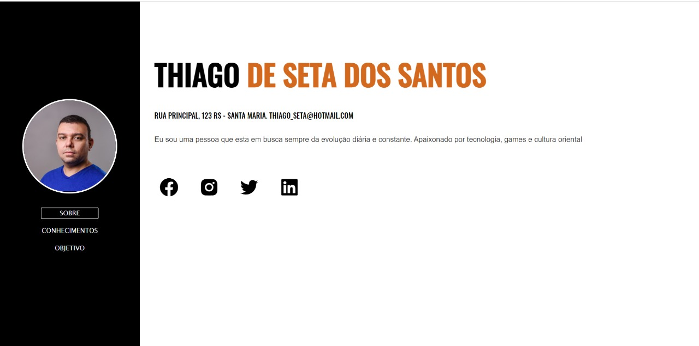

# desafio-curriculo-growdev

## 💻 Sobre o projeto

Desafio concluido sobre a criação de um curríulo digital feito em javascript.

---

 

  

## 🛠 Tecnologias

As seguintes ferramentas foram usadas na construção do projeto:

- JavaScript
- HTML
- CSS

## 📝 Licença

Este projeto esta sobe a licença [MIT](./LICENSE).
